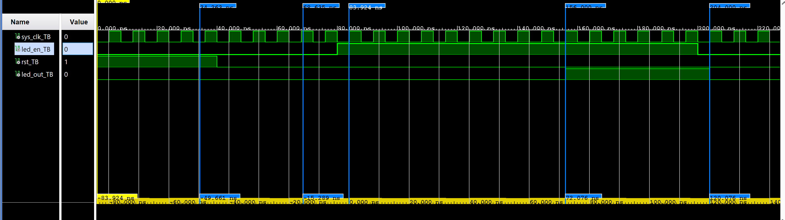
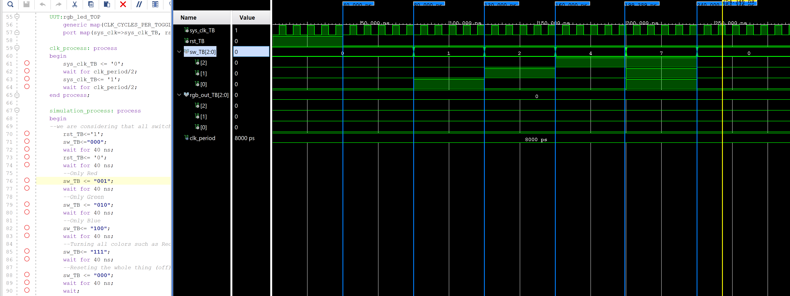

# Overview

During the lab we designed a module that blinks the LED every second on the Zybo Z7-10 development board. 

# Design Summary
## Blinking LED with Zybo Z7-10 Development Board
To begin with our first VHDL Lab we must begin with defining the I/O ports that's given to implement.

Given four signals name such as sys_clk, rst, led_en and led_out where all of them are one bit width and three of them are Inputs and one of them is an output. 

Inside the entity the port and generic must be inside. Here's the following syntax VHDL code for the port section:

```
 port (sys_clk,rst,led_en: in std_logic;
 led_out: out std_logic); 
```

To declare a generic given name as CLK_CYCLES_PER_TOGGLE given a default value as 62,500,000.

generic is a value you set when you instantiate the module. Essentially a constant parameter passed into the module from outside. The generic section is before the port section.
```
generic (CLK_CYCLES_PER_TOGGLE: integer := 62500000);
```
Architecure is where the behavioral or connections happen. But first we must define the signals that we might need such as:

count_reg is where it tracks how many rising clock edges have occured. It increments by 1 each cycle and resets back to 0 once it reaches the toggle threshold.

led_reg is what holds the current state of the LED output either 0 or 1. 
```
signal count_reg: integer range 0 to CLK_CYCLES_PER_TOGGLE - 1:= 0;
signal led_reg:std_logic:= '0';
```
The design uses an internal counter that increments on each rising edge of the system clock. Once the counter hits the CLK_CYCLES_PER_TOGGLE threshold, the LED output flips its state and counter resets to zero. If either reset signal goes high or the LED enable is low, both the counter and led_out are immediately cleared to 0. While the development board running at 125 MHz and the default parameter value of 62500000, LED toggles every 0.5 seconds.

led_out <= led_reg is a continous assignment wehere it connects the internal led_reg signal directly to the output port led_out.
```
led_out <= led_reg;
```

process(rst,sys_clk) defines a synchronous process with an asyncrhonous reset.
```
process(rst,sys_clk)
```

if rst = '1' is the asynchrnous reset where it doesn't wait for a clock edge. Once rst goes high both counter and LED are cleared to 0, regardless of what the clock is doing.
```
if rst = '1'
```

elsif rising_edge(sys_clk) is what makes it a syncrhnous design. Basically where all logic is clocked.
```
elsif rising_edge(sys_clk)
```

if led_en = '0' is where if the LED enable is low, both the counter and LED get forced to 0. LED stays off and counter stops (pausing it basically)
```
if led_en = '0'
```
elsif count_reg = CLK_CYCLES_PER_TOGGLE - 1 is where the counter reaches the threshold, there will be two things happening the two counter resets back to 0 and led_reg flips its value using not led_reg.
```
elsif count_reg = CLK_CYCLES_PER_TOGGLE - 1
```
else count_reg <= count_reg + 1 is where if none of the conditions above are true, the counter will just keep incrementing by 1 each block cycle.
```
else count_reg <= count_reg + 1 
```

The testbench (TB) was used to verify the functionality of the blinking_led entity just in simulation. There were three cases done to test the simulations. Such as the LED output and counter must both be cleared when reset is active or the enable signal is low, the LED must toggle at a fixed interval determined by the clock parameter, and disabling the LED while it is actively toggling  must immediately drive the output back to zero.
## RGB LED with Zybo Z7-10 Development Board
This lab builds on top of the blinking_led entity.The top-level entity takes in a 3 bit switch input sw and outputs a 3-bit signal rgb_out where each bit coressponds to a color:
```
sw(0) -> Red   -> rgb_out(0)
sw(1) -> Green -> rgb_out(1)
sw(2) -> Blue  -> rgb_out(2)
```
Then three internal signals were declared to hold each color's LED state.
```
signal RGB_RED:std_logic; -- driven by SW0
signal RGB_GREEN:std_logic; -- driven by SW1
signal RGB_BLUE:std_logic; -- driven by SW2
```
Each blinking_led instances uses its coressponding switch bit as the led_en input. So this means that only the active switch will allow its color to blink or display. If the switch is low, that color stays off. Since the outputs are wired to rgb_out:

```
rgb_out(0) <= RGB_RED;
rgb_out(1) <= RGB_GREEN;
rgb_out(2) <= RGB_BLUE;
```

# Verification and Testing

## Results for blinking_led_TB.vhd 



## Results for RGB_LED.vhd


# Known Issues and Limitations
One issue I ran into was expecting the hardware to update automatically once the bitstream finished generating. However, the bitstream must be first prrogrammed onto the device before any changes are reflected onto the hardware, in this case the RGB LED on the Zybo Z7-10.
# References
Learned how to Archive a vivado project
https://docs.amd.com/r/en-US/ug895-vivado-system-level-design-entry/Archiving-Projects